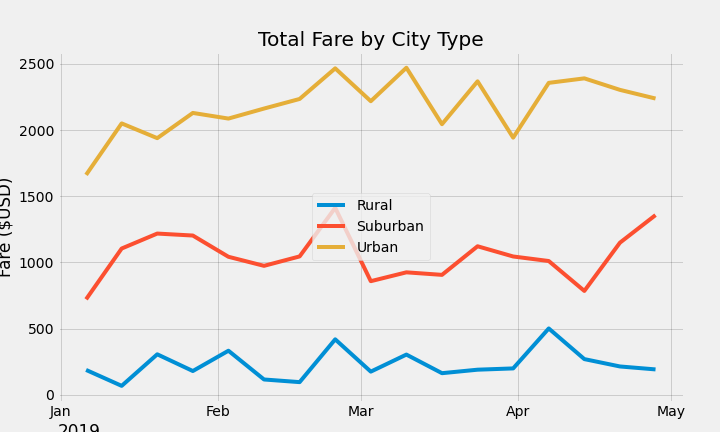

# Analysis of PyBer Ride-Sharing Data

## Purpose
This analysis was performed to determine whether there is a difference in ridership that is attributable to the type of city.  This information will allow PyBer executives to optimize business operations.

## Methodology
Two CSV files provided the data for the analysis:
* ```city_data.csv``` - This file provided the type of city and number of drivers.
* ```ride_data.csv``` - This file provided ride details (the city, date of the ride, the fare, and a ride ID).

These files were examined using Python with Jupyter Notebook, Pandas, and Matplotlib.

The data from both input files were merged into a Pandas DataFrame.


Using the input data, a Pandas DataFrame was constructed to contain summary information for the analysis. 


A new Pandas DataFrame was constructed from the input data, using a multi-index technique to enable the creation of view of the data from a date-based perspective.


The Pandas pivot command was used to consolidate the fare data by each date, while retaining the city-type details.


# Results

From the summary DataFrame, we can see that there are clear differences in each column that are based on the type of city.  Ther results for each metric is described below:

* Total Rides - Rural cities have the lowest ridership. 
	* Rural Cities - 5.26% of total rides.
	* Suburban Cities - 26.32% of total rides.
	* Urban Cities - 68.42% of total rides.

* Total Drivers - Rural cities have the lowest number of drivers.
	* Rural Cities - 2.62% of total drivers.
	* Suburban Cities - 16.48% of total drivers.
	* Urban Cities - 80.89% of total drivers.

* Total Fares - Rurals cities have the lowest revenue.
	* Rural Cities - 6.81% of total fares collected.
	* Suburban Cities - 30.46% of total fares collected.
	* Urban Cities - 62.72% of total fares collected.
These results are visible in the chart of weekly fares per city-type.  In this chart we see that there is distinct stratification of the fare revenue according to the type of city.


	

* Average Fare per Ride - Rural cities have the highest fares per ride

* Average Fare per Driver - Rural cities have the highest fares per driver.

# Summary

This analysis shows that there are operational differences based on the type of city.

I recommend collecting additional data to better understand the cause of these city-type difference. The following metrics will provide information about the rides in each type of city, as well as the demographics of the drivers and riders.

### New Metric Recommendations

* distance of ride
* time-of-day
* gender of riders
* gender of drivers
* age of riders
* age of drivers


